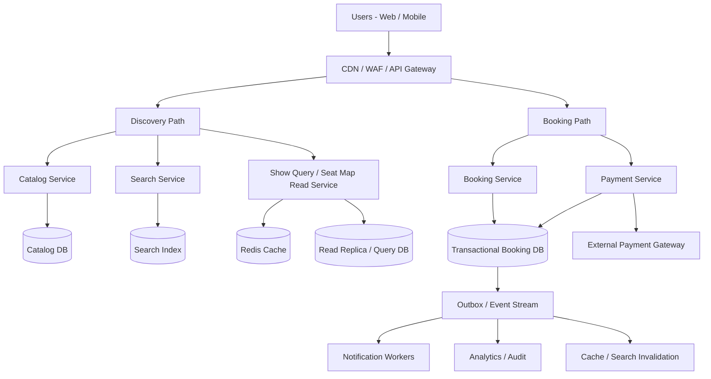
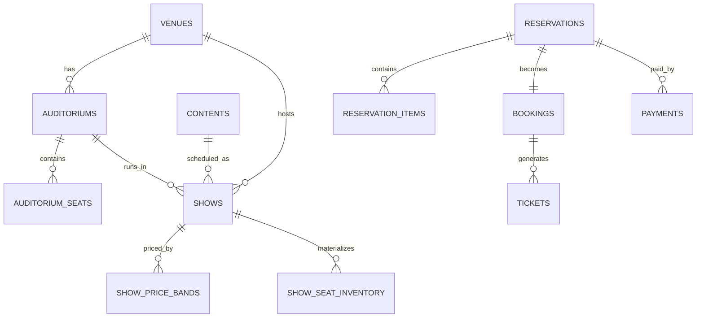
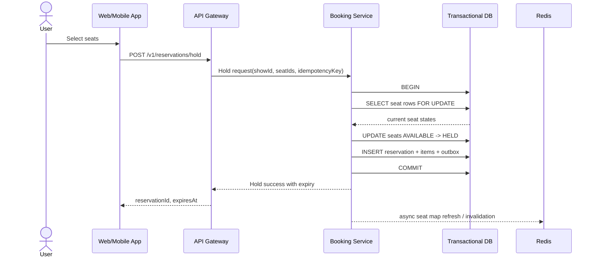
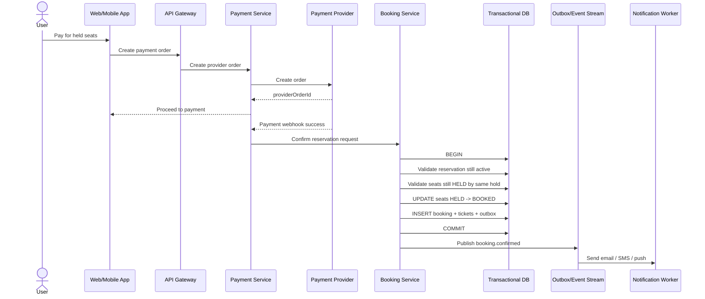
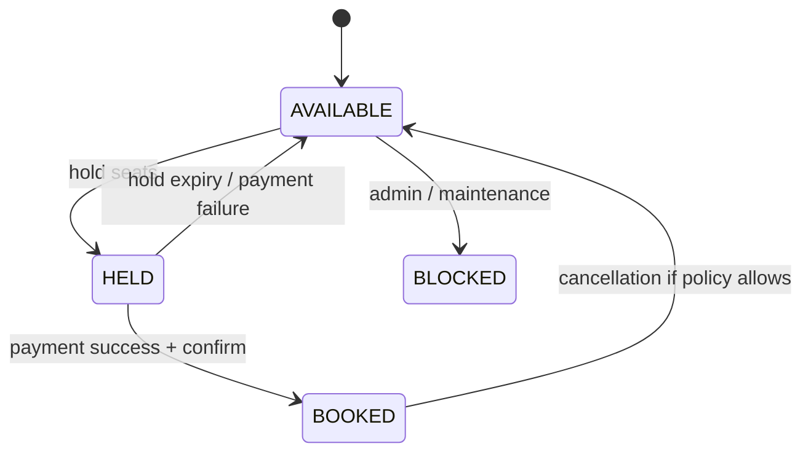

# BookMyShow Style Ticketing Platform - Interview System Design

## 1. Problem Statement

Design a platform similar to BookMyShow that allows users to:

- discover movies and events by city, venue, date, language, and format
- view show details and the seat map
- temporarily hold seats
- pay and confirm the booking
- receive tickets and booking notifications
- cancel and refund bookings when allowed

This is a classic high-read, high-contention booking system. The main engineering challenge is not generic CRUD. The hard part is preventing double booking under bursty traffic for the same show.

The correct design principle is:

- browsing can be eventually consistent
- seat inventory and booking must be strongly consistent

If that line is not drawn clearly, the design usually collapses under concurrency.

---

## 2. Interview Framing

### What makes this problem hard

- very high read traffic for search and seat maps
- hotspot writes when many users try to book the same show at the same time
- strict correctness requirement: the same seat must never be sold twice
- payment systems are asynchronous and failure-prone
- user retries, webhook retries, and network timeouts make idempotency mandatory

### Top-level design principle

Split the platform into two different subsystems:

1. `Discovery System`
   - city, movie, venue, date, and search queries
   - optimized for read scale, caching, and search
   - eventual consistency is acceptable
2. `Inventory + Booking System`
   - seat status, holds, booking confirmation, payments
   - optimized for correctness and transactional integrity
   - strong consistency is required

---

## 3. Functional Requirements

### Core requirements

- browse movies and events for a given city and date
- list shows for a movie or event
- fetch seat map for a show
- hold selected seats for a short TTL, for example 5 minutes
- create payment order and capture payment
- confirm booking and generate tickets
- allow user to view booking history
- support cancellation and refund when policy allows
- support admin onboarding of venues, auditoriums, and shows

### Nice-to-have

- recommendations
- waitlist for sold-out shows
- dynamic pricing
- coupons and promotions
- loyalty points
- real-time seat map updates over websockets

---

## 4. Non-Functional Requirements

- no double booking
- high availability for browse APIs
- graceful degradation for seat-map reads
- low latency for seat hold operations
- idempotent APIs for payment and booking transitions
- strong auditability for payment and refund state changes
- support regional scaling across many cities

### SLO targets

- browse APIs p95 under `150 ms`
- seat map API p95 under `250 ms`
- seat hold API p95 under `300 ms` for a normal hot show
- booking confirmation p95 under `500 ms` excluding external payment latency
- oversell count = `0`

---

## 5. Capacity Estimation

These numbers are not exact production numbers. They are enough for interview sizing.

### Assumptions

- `10,000` screens
- `5` shows per screen per day
- `200` seats per screen on average
- booking horizon of `7` days

### Derived numbers

- shows per day = `10,000 * 5 = 50,000`
- seat inventory rows per day = `50,000 * 200 = 10,000,000`
- hot booking horizon inventory rows = `10,000,000 * 7 = 70,000,000`

### Traffic shape

- browse QPS is much larger than booking QPS
- the main scaling problem is not average load
- the main scaling problem is intense contention on a small number of very popular `show_id`s

This means sharding should be aligned to write contention, not just even data distribution.

---

## 6. Core Entities

- `City`
- `Venue`
- `Auditorium`
- `Seat`
- `Content` for movie or event
- `Show`
- `PriceBand`
- `Reservation` or temporary hold
- `Payment`
- `Booking`
- `Ticket`

Important modeling decision:

- seat layout is mostly static at auditorium level
- seat availability is dynamic at show level

So we store:

- static seat metadata in `auditorium_seats`
- dynamic seat state in `show_seat_inventory`

That separation is important for both performance and correctness.

---

## 7. High-Level Architecture

### 7.1 Main Services

- `API Gateway`
- `Identity Service`
- `Catalog Service`
- `Search Service`
- `Show Query Service`
- `Seat Map Service`
- `Booking Service`
- `Payment Service`
- `Notification Service`
- `Admin Service`
- `Pricing Service`
- `Analytics Pipeline`

### Design note

In a real company, I would not necessarily deploy all of these as separate microservices on day one. The better approach is:

- keep browse modules separate from booking modules
- keep the transactional booking boundary very tight
- evolve deployment boundaries only when scale or team topology requires it

---

### 7.2 Block Diagram

```text
                                  +----------------------+
Users on Web / Mobile ----------> | CDN + WAF + API GW   |
                                  +----------+-----------+
                                             |
                     +-----------------------+------------------------+
                     |                                                |
                     |                                                |
             Browse / Discovery Path                          Booking / Transaction Path
                     |                                                |
      +--------------+--------------+                     +-----------+-------------+
      |                             |                     |                         |
+-----v------+               +------v------+       +------v-------+         +-------v------+
| Catalog    |               | Search      |       | Booking      |         | Payment       |
| Service    |               | Service     |       | Service      |         | Service       |
+-----+------+               +------+------+       +------+-------+         +-------+------+
      |                             |                     |                         |
+-----v------+               +------v------+       +------v-------------------------v------+
| Catalog DB |               | Search Index |      | Transactional Booking DB             |
+------------+               +-------------+       | shows, show_seat_inventory,         |
                                                   | reservations, payments, bookings,   |
                                                   | tickets, outbox                     |
                                                   +----------------+--------------------+
                                                                    |
                                                       +------------v------------+
                                                       | Outbox / Event Stream   |
                                                       +------+---------+--------+
                                                              |         |        
                                                        +-----v--+   +--v-----+   +----------------+
                                                        | Notify |   | BI /   |   | Cache / Search |
                                                        | Worker |   | Audit  |   | Invalidation   |
                                                        +--------+   +--------+   +----------------+

                          +------------------------------+
                          | Redis                        |
                          | hot show seat map cache      |
                          | price cache                  |
                          | short-lived query results    |
                          +------------------------------+
```

---

## 8. Data Flow Separation

### Browse path

- catalog and search queries hit cache, replicas, and search index
- eventual consistency is fine
- stale data for a few seconds is acceptable

### Booking path

- seat hold and booking hit the primary transactional store
- reads that affect correctness must go to the source of truth
- stale reads are not acceptable for seat allocation

This boundary is one of the most important interview points.

---

## 9. API Design

### 9.1 Discovery APIs

### Get cities

```http
GET /v1/cities
```

### Search content by city and date

```http
GET /v1/contents?cityId=101&date=2026-04-25&language=english
```

### Get shows for a content item

```http
GET /v1/shows?contentId=5001&cityId=101&date=2026-04-25
```

### Get seat map

```http
GET /v1/shows/{showId}/seat-map
```

### Example seat map response

```json
{
  "showId": "show_98231",
  "contentId": "movie_331",
  "venueId": "venue_11",
  "auditoriumId": "aud_3",
  "startsAt": "2026-04-25T13:30:00Z",
  "pricingVersion": 7,
  "seatMapVersion": 91842,
  "seats": [
    {
      "seatId": "seat_1001",
      "row": "A",
      "number": "10",
      "zoneCode": "GOLD",
      "seatType": "REGULAR",
      "state": "AVAILABLE",
      "price": {
        "currency": "INR",
        "amountPaisa": 32000
      },
      "x": 10,
      "y": 1
    }
  ]
}
```

### 9.2 Booking APIs

### Hold seats

```http
POST /v1/reservations/hold
X-Idempotency-Key: 1cfd0a67-2ef1-4d3a-a4f2-5b4f6d3e09a0
```

```json
{
  "showId": "show_98231",
  "seatIds": ["seat_1001", "seat_1002"],
  "pricingVersion": 7
}
```

### Hold success response

```json
{
  "reservationId": "res_55191",
  "holdId": "b3b5b6df-3b85-4c84-a8b6-7c1fd6537f62",
  "state": "HELD",
  "expiresAt": "2026-04-22T16:35:00Z",
  "amount": {
    "currency": "INR",
    "amountPaisa": 70400
  },
  "lineItems": [
    {
      "seatId": "seat_1001",
      "basePricePaisa": 32000,
      "feePaisa": 2000,
      "taxPaisa": 1200
    },
    {
      "seatId": "seat_1002",
      "basePricePaisa": 32000,
      "feePaisa": 2000,
      "taxPaisa": 1200
    }
  ]
}
```

### Hold conflict response

```json
{
  "code": "SEAT_UNAVAILABLE",
  "showId": "show_98231",
  "unavailableSeatIds": ["seat_1002"]
}
```

### Create payment order

```http
POST /v1/payments/orders
```

```json
{
  "reservationId": "res_55191",
  "provider": "RAZORPAY",
  "paymentMethod": "UPI"
}
```

### Payment order response

```json
{
  "paymentId": "pay_7719",
  "providerOrderId": "order_NA8W",
  "state": "INITIATED",
  "amount": {
    "currency": "INR",
    "amountPaisa": 70400
  }
}
```

### Booking details

```http
GET /v1/bookings/{bookingRef}
```

### Cancel booking

```http
POST /v1/bookings/{bookingRef}/cancel
```

---

## 10. Low-Level Data Structures

### 10.1 Static master tables

```sql
cities(
  city_id bigint primary key,
  name varchar(64) not null,
  timezone varchar(64) not null
);

venues(
  venue_id bigint primary key,
  city_id bigint not null,
  name varchar(128) not null,
  address text,
  latitude decimal(9,6),
  longitude decimal(9,6),
  status smallint not null
);

auditoriums(
  auditorium_id bigint primary key,
  venue_id bigint not null,
  name varchar(64) not null,
  total_seats int not null,
  seat_layout_version int not null,
  status smallint not null
);

auditorium_seats(
  seat_id bigint primary key,
  auditorium_id bigint not null,
  seat_index int not null,
  row_label varchar(8) not null,
  seat_number varchar(8) not null,
  zone_code varchar(32) not null,
  seat_type varchar(16) not null,
  x int not null,
  y int not null,
  is_active boolean not null,
  unique(auditorium_id, row_label, seat_number),
  unique(auditorium_id, seat_index)
);

contents(
  content_id bigint primary key,
  content_type varchar(16) not null,
  title varchar(256) not null,
  language varchar(32),
  duration_mins int,
  rating varchar(16),
  metadata_json jsonb,
  status smallint not null
);

shows(
  show_id bigint primary key,
  content_id bigint not null,
  venue_id bigint not null,
  city_id bigint not null,
  auditorium_id bigint not null,
  starts_at_utc timestamptz not null,
  ends_at_utc timestamptz not null,
  venue_timezone varchar(64) not null,
  format varchar(32),
  inventory_mode varchar(16) not null,
  status smallint not null,
  created_at timestamptz not null
);

show_price_bands(
  price_band_id bigint primary key,
  show_id bigint not null,
  zone_code varchar(32) not null,
  price_paise bigint not null,
  convenience_fee_paise bigint not null,
  tax_bps int not null,
  pricing_version int not null
);
```

### 10.2 Transactional hot tables

```sql
show_seat_inventory(
  show_id bigint not null,
  seat_id bigint not null,
  status smallint not null,
  hold_id uuid null,
  hold_expires_at timestamptz null,
  booking_id bigint null,
  price_band_id bigint not null,
  version bigint not null default 0,
  updated_at timestamptz not null,
  primary key (show_id, seat_id)
);

reservations(
  reservation_id bigint primary key,
  hold_id uuid not null unique,
  user_id bigint not null,
  show_id bigint not null,
  state varchar(32) not null,
  amount_paise bigint not null,
  expires_at timestamptz not null,
  idempotency_key varchar(64) not null,
  created_at timestamptz not null,
  updated_at timestamptz not null,
  unique(user_id, idempotency_key)
);

reservation_items(
  reservation_id bigint not null,
  seat_id bigint not null,
  unit_price_paise bigint not null,
  fee_paise bigint not null,
  tax_paise bigint not null,
  primary key (reservation_id, seat_id)
);

payments(
  payment_id bigint primary key,
  reservation_id bigint not null,
  provider varchar(32) not null,
  provider_order_id varchar(128),
  provider_payment_id varchar(128),
  state varchar(32) not null,
  amount_paise bigint not null,
  currency char(3) not null,
  raw_payload_json jsonb,
  idempotency_key varchar(64),
  created_at timestamptz not null,
  updated_at timestamptz not null,
  unique(provider, provider_payment_id)
);

bookings(
  booking_id bigint primary key,
  reservation_id bigint not null unique,
  booking_ref varchar(32) not null unique,
  user_id bigint not null,
  show_id bigint not null,
  state varchar(32) not null,
  total_amount_paise bigint not null,
  created_at timestamptz not null
);

tickets(
  ticket_id bigint primary key,
  booking_id bigint not null,
  seat_id bigint not null,
  qr_jti uuid not null unique,
  ticket_status varchar(16) not null,
  created_at timestamptz not null
);

refunds(
  refund_id bigint primary key,
  booking_id bigint not null,
  payment_id bigint not null,
  provider_refund_id varchar(128),
  state varchar(32) not null,
  amount_paise bigint not null,
  created_at timestamptz not null,
  updated_at timestamptz not null
);

outbox_events(
  event_id bigint primary key,
  aggregate_type varchar(32) not null,
  aggregate_id bigint not null,
  event_type varchar(64) not null,
  payload_json jsonb not null,
  published_at timestamptz null,
  created_at timestamptz not null
);
```

### 10.3 Why this schema works well

- `auditorium_seats` is static and reusable across many shows
- `show_seat_inventory` is the authoritative source of seat state for one specific show
- `reservations` captures temporary hold state
- `reservation_items` stores price snapshot at hold time
- `payments` tracks async gateway interactions
- `bookings` is the durable business confirmation
- `outbox_events` guarantees reliable event publication after DB commit

---

## 11. Partitioning and Sharding Strategy

### Shard key choice

For booking writes, shard by `show_id`.

### Why `show_id` is the right choice

- all conflicting seat updates happen inside one show
- all seat rows for a booking belong to one show
- lock scope stays local to a shard
- booking transactions remain single-shard

### Why not shard by `user_id`

- a user rarely generates the write hotspot
- contention happens because many users hit the same show

### Why not shard by `city_id`

- a city is too coarse
- a blockbuster show in a large city still creates a hotspot inside the shard

### Practical layout

- `shows` can be partitioned by date and maybe city
- `show_seat_inventory`, `reservations`, `bookings`, and `payments` should be colocated by `show_id`

---

## 12. Seat Hold and Booking Algorithm

This is the most important low-level section.

### 12.1 Seat state machine

```text
AVAILABLE -> HELD -> BOOKED
AVAILABLE -> BLOCKED
HELD -> AVAILABLE   (hold expiry or payment failure)
BOOKED -> AVAILABLE (only if cancellation policy allows)
```

### 12.2 Reservation state machine

```text
HELD -> PAYMENT_PENDING -> CONFIRMED
HELD -> EXPIRED
HELD -> PAYMENT_FAILED
CONFIRMED -> CANCELLED
```

### 12.3 Seat hold flow

1. client calls `POST /v1/reservations/hold`
2. request includes `showId`, `seatIds`, and `X-Idempotency-Key`
3. booking service routes by `show_id` to the correct shard
4. seat IDs are sorted before locking to avoid deadlocks
5. transaction does `SELECT ... FOR UPDATE` on requested seat rows
6. any expired holds are treated as releasable inside the same transaction
7. if all seats are available, update them to `HELD`
8. create reservation row and reservation item rows
9. insert outbox event
10. commit

### Pseudocode

```sql
BEGIN;

SELECT seat_id, status, hold_expires_at
FROM show_seat_inventory
WHERE show_id = :show_id
  AND seat_id IN (:sorted_seat_ids)
ORDER BY seat_id
FOR UPDATE;

UPDATE show_seat_inventory
SET status = 1,
    hold_id = :hold_id,
    hold_expires_at = NOW() + INTERVAL '5 minutes',
    version = version + 1,
    updated_at = NOW()
WHERE show_id = :show_id
  AND seat_id IN (:sorted_seat_ids)
  AND (
    status = 0
    OR (status = 1 AND hold_expires_at < NOW())
  );

-- affected rows must equal requested seat count

INSERT INTO reservations(... state='HELD', expires_at=NOW() + INTERVAL '5 minutes', ...);
INSERT INTO reservation_items(...);
INSERT INTO outbox_events(... event_type='seat.held' ...);

COMMIT;
```

### Why row locking is acceptable here

- a booking touches a very small number of rows
- conflicts are tightly localized
- correctness is more important than theoretical write throughput
- this is a classic place to prefer simple ACID semantics over distributed lock complexity

### 12.4 Booking confirmation flow

1. payment order is created after the hold
2. payment gateway callback or webhook reports success
3. booking service processes callback idempotently
4. transaction verifies:
   - reservation exists
   - reservation is still valid
   - seats are still held by this reservation
5. seats move from `HELD` to `BOOKED`
6. reservation becomes `CONFIRMED`
7. booking row and ticket rows are inserted
8. outbox event is written in the same transaction
9. notification is sent asynchronously after commit

### Important invariant

Payment success alone does not mean booking success.

Booking becomes valid only when the booking transaction commits and seat rows are atomically moved to `BOOKED`.

---

## 13. Handling Hold Expiry

### Option 1: lazy expiry during next write

When a new hold request touches a seat:

- if seat is `HELD` but `hold_expires_at < now()`
- current transaction can reclaim it

### Option 2: background sweeper

Periodic job scans expiring holds and releases seats.

### Recommended approach

Use both:

- lazy expiry for correctness during booking contention
- sweeper for cleanup and cache freshness

This avoids over-dependence on a background job for correctness.

---

## 14. Payment Design

### Core payment rules

- client redirect is not authoritative
- payment webhook is authoritative
- all gateway callbacks must be idempotent
- booking and payment are related but not the same state machine

### Payment flow

1. create provider order
2. user completes payment on provider side
3. provider calls webhook
4. payment record is updated idempotently
5. booking service attempts confirmation
6. if hold expired and seats are gone, booking is not created
7. compensating refund or void flow is triggered

### Why idempotency is mandatory

- user can click multiple times
- mobile networks retry
- payment providers retry
- webhook delivery is at-least-once

Use:

- `X-Idempotency-Key` for client APIs
- unique constraints on gateway identifiers
- internal dedupe on event processing

---

## 15. Caching Strategy

### Good things to cache

- city list
- movie catalog
- show listings
- pricing metadata
- static seat layout
- hot show dynamic seat status snapshot

### Do not trust cache for correctness

Redis can accelerate reads, but it must not be the source of truth for seat allocation.

### Recommended Redis usage

- key: `seatmap:{show_id}:layout` for static seat layout
- key: `seatmap:{show_id}:status` for compressed status bitmap
- key: `show:{show_id}:pricing`
- short-lived query caches for popular browse queries

### Efficient seat status representation

For a show with a few hundred seats:

- map each seat to a dense `seat_index`
- encode state using compact integers or bitmaps
- this keeps the hot seat map very small in memory

---

## 16. Search and Discovery Design

### What belongs in search

- city
- movie title
- genre
- language
- venue
- format
- show dates

### Search storage

Use a search index such as OpenSearch or Elasticsearch for:

- text search
- faceted filters
- city/date aggregations

### Sync model

- source of truth remains the relational catalog DB
- index updates happen asynchronously through change events
- temporary lag is acceptable in browse/search flows

---

## 17. Concurrency and Failure Handling

### 17.1 Key failure scenarios

### Scenario: two users try to book the same seat

- both requests hit the same `show_id` shard
- row-level lock serializes updates
- only one transaction succeeds

### Scenario: payment succeeds after hold expiry

- booking transaction rechecks reservation and seat ownership
- if reservation is invalid, booking is rejected
- refund or void is triggered

### Scenario: webhook arrives twice

- dedupe by provider identifiers and internal idempotency key
- second processing becomes a no-op

### Scenario: DB commit succeeds but notification fails

- outbox event still exists
- worker retries later
- booking correctness is not affected

### Scenario: Redis says available but DB says booked

- booking path trusts DB
- cache is repaired asynchronously

### 17.2 Patterns used

- row-level locking
- idempotency keys
- unique constraints
- outbox pattern
- retry with backoff
- reconciliation jobs

---

## 18. Database Choices

### Recommended primary choice

Use a relational transactional database such as PostgreSQL, MySQL, or a distributed SQL system if scale requires it.

### Why relational DB works well here

- transactional consistency is critical
- row-level locking semantics are useful
- schema is structured and strongly related
- joins are manageable in the transactional boundary

### When to move to distributed SQL

If the platform grows to extreme scale across many regions and shards become operationally painful, a distributed SQL system can help. But the design principle stays the same:

- inventory correctness remains inside a transactional boundary

---

## 19. Consistency Model

### Strong consistency required for

- seat hold
- booking confirmation
- payment-to-booking state transition
- cancellation and seat release

### Eventual consistency acceptable for

- search index
- notifications
- analytics
- user history read models
- browse caches

This distinction should be stated clearly in the interview.

---

## 20. Multi-Region Strategy

### Recommended model

- each show has a home region
- all writes for that show go to the home region
- read replicas can serve nearby browse traffic
- cross-region replication is for disaster recovery and remote reads

### Why not active-active booking everywhere

Active-active seat booking is much more complex because:

- split brain risk is dangerous
- conflicting seat allocation becomes harder
- correctness matters more than shaving a few milliseconds of global latency

A safer answer is:

- keep write ownership single-region per show
- accept controlled failover if needed

---

## 21. Security, Compliance, and Abuse Prevention

### Security

- do not store raw card details
- rely on payment provider tokenization
- encrypt PII at rest
- sign QR tokens
- validate ticket scan requests against replay

### Abuse prevention

- rate limit by user, IP, device, and show
- CAPTCHA or bot defense for flash sales
- waiting room for extremely hot releases
- anomaly detection for scripted seat sniping

---

## 22. Observability and Metrics

### Business metrics

- browse-to-hold conversion
- hold-to-payment conversion
- payment success rate
- booking success rate
- refund rate
- oversell count

### Technical metrics

- DB lock wait time by `show_id`
- hold API latency
- cache hit ratio
- seat map staleness
- webhook processing lag
- outbox backlog

### Audit needs

- every payment transition must be traceable
- every booking must have correlation IDs
- every refund must be tied to payment and booking records

---

## 23. Common Interview Tradeoffs

### 23.1 Why not use Redis locks for seat booking

Redis locks add distributed systems complexity and still require a transactional source of truth. If Redis and DB disagree, DB must win. So Redis should remain an accelerator, not the final allocator.

### 23.2 Why materialize `show_seat_inventory`

Because seat availability is per show, not just per auditorium. Materializing per-show rows makes concurrency, pricing snapshotting, and correctness much simpler.

### 23.3 Why not fully event-source the booking path

Pure event sourcing can work, but it makes the critical seat allocation path harder to reason about in an interview setting. The simpler and stronger choice is ACID row updates plus outbox events.

### 23.4 Why not over-split into too many services

Because the most important production requirement is booking correctness. Operational simplicity in the transactional core usually beats premature microservice decomposition.

---

## 24. End-to-End Sequence Summary

### Browse flow

1. user opens app
2. app fetches city, content, and show list
3. search index and cache serve most of the load

### Seat selection flow

1. user opens seat map
2. seat layout comes from cache or replica
3. dynamic seat status comes from Redis snapshot or DB-backed read service

### Booking flow

1. user selects seats
2. booking service places hold transactionally
3. user initiates payment
4. payment webhook confirms payment
5. booking service confirms reservation transactionally
6. ticket is generated
7. notification is sent asynchronously

---

## 25. Final Interview Answer

If I had to summarize the design in a few sentences:

- I would separate browse from booking.
- I would treat `show_seat_inventory` as the source of truth for seat state.
- I would shard the transactional path by `show_id`.
- I would use ACID transactions with row-level locking for seat hold and booking confirmation.
- I would keep payments idempotent and asynchronous.
- I would use Redis and search indexes to scale reads, but never as the final source of seat allocation truth.

That gives a system that is simple enough to reason about, scales well for reads, and most importantly guarantees that one seat is sold to only one user.

---

## 26. 45-Minute Interview Version

This section is a shorter interview-friendly version of the same design. The original detailed write-up above remains the source of truth. Use this version when you want to answer in a structured and time-bounded way during an interview.

### 26.1 How I would structure the answer in 45 minutes

1. clarify scope and assumptions
2. identify the hardest problem
3. propose high-level architecture
4. define core data model
5. deep dive into seat locking and booking flow
6. explain scale, sharding, and caching
7. close with failure handling and tradeoffs

### 26.2 Short interview script

If I were answering live in a 45-minute interview, I would say:

We are designing a BookMyShow-like platform where users browse movies or events, see available shows and seat maps, hold seats temporarily, pay, and confirm tickets. The hardest requirement is preventing double booking when many users attempt to reserve the same seats at the same time.

I would split the system into two logical paths:

- discovery path for browsing, search, city filters, and show listings
- transactional booking path for seat holds, payments, and final booking confirmation

The discovery path can be eventually consistent and heavily cached. The booking path must be strongly consistent.

### 26.3 Scope I would explicitly state

In scope:

- browse content by city and date
- fetch shows
- fetch seat map
- hold seats for a few minutes
- pay and confirm booking
- cancel and refund where allowed

Out of scope unless asked:

- recommendation engine
- ad platform
- personalized ranking
- loyalty system
- dynamic pricing engine internals

### 26.4 High-level design summary

I would use:

- API gateway for request routing
- catalog service plus search index for browse
- booking service for seat hold and booking orchestration
- payment service for gateway integration
- notification workers for email, SMS, and push
- relational transactional database for inventory and booking correctness
- Redis for read-side acceleration only
- outbox plus event stream for notifications, analytics, and cache invalidation

### 26.5 Core data model summary

I would keep:

- static seat layout at auditorium level
- dynamic seat inventory at show level

Main tables:

- `shows`
- `auditorium_seats`
- `show_seat_inventory`
- `reservations`
- `reservation_items`
- `payments`
- `bookings`
- `tickets`

The most important table is `show_seat_inventory(show_id, seat_id)` because that is the authoritative seat state for a particular show.

### 26.6 Core invariant

The same seat for the same show must never be sold twice.

I would enforce this by:

- putting all seat allocation inside a DB transaction
- locking requested seat rows in sorted order
- moving seat state from `AVAILABLE -> HELD -> BOOKED`
- never trusting Redis as the allocator

### 26.7 Seat hold flow in a short answer

1. user selects seats and sends hold request with idempotency key
2. booking service routes request by `show_id`
3. DB transaction locks the requested seat rows using `SELECT ... FOR UPDATE`
4. if all seats are available, mark them `HELD` with `hold_expires_at`
5. create `reservation` and `reservation_items`
6. commit transaction
7. payment can now begin

If any seat is already taken, return conflict and do not partially allocate.

### 26.8 Booking confirmation flow in a short answer

1. create payment order after successful hold
2. payment gateway webhook reports success
3. process webhook idempotently
4. transaction verifies reservation is still valid and seat rows still belong to this hold
5. move seats from `HELD` to `BOOKED`
6. create `booking` and `tickets`
7. write outbox event
8. notification happens asynchronously

Important interview statement:

- payment success is not equal to booking success
- booking is successful only after the booking transaction commits

### 26.9 Partitioning strategy

I would shard the booking path by `show_id`.

Reason:

- all write contention is around one show
- all seats in a booking belong to one show
- transactions stay local to one shard

I would not shard by `user_id` because the hotspot is the show, not the user.

### 26.10 Caching strategy

Cache:

- city lists
- content listings
- show listings
- static seat layout
- compressed seat availability snapshots

Do not cache as source of truth for:

- seat allocation
- booking confirmation

### 26.11 Top failure cases I would mention

- two users book the same seat at once
- payment succeeds after hold expiry
- payment webhook is delivered multiple times
- DB commit succeeds but notification fails
- cache says available while DB says booked

The solution set is:

- ACID transactions
- row locking
- idempotency keys
- unique constraints
- outbox pattern
- compensating refund flow

### 26.12 Scaling summary

Reads scale through:

- CDN
- cache
- replicas
- search index

Writes scale through:

- sharding by `show_id`
- keeping booking transactions small
- limiting lock scope to seat rows for one show

### 26.13 Good final summary for an interview

My design separates browse from booking. Browse is cache-heavy and eventually consistent. Booking is strongly consistent and uses a transactional seat inventory table keyed by `show_id` and `seat_id`. I would use row-level locking for seat holds, idempotent payment processing, and an outbox for downstream side effects. That gives correctness first, while still scaling read traffic and handling hot shows safely.

---

## 27. Mermaid Diagrams

These diagrams are an appendix for revision and interview prep. They represent the same design from the main sections above in a faster-to-read visual format.

### 27.1 High-Level Architecture Diagram



### 27.2 Core Entity Relationship View



### 27.3 Seat Hold Sequence Diagram



### 27.4 Booking Confirmation Sequence Diagram



### 27.5 Reservation and Seat State Diagram



### 27.6 Short Design Takeaway From The Diagrams

The diagrams reinforce the same main point:

- read paths are optimized separately from booking paths
- the DB owns booking correctness
- payment is asynchronous
- side effects happen after commit through outbox processing
